# Writing-and-Presentation-Test week 1

## Day 1 : Unix Command Line dan GIT & GITHUB

**Senin, 19 September 2022**

### Command Line Interface (CLI)

**Command Line Interface (CLI) : shell yang berbasis teks**

lalu shell itu apa? **Shell** adalah program yang menerima perintah lalu di eksekusi oleh system.

untuk mengakses CLI bisa menggunakan GIT

**cara mengakses CLI bagaimana?**
klik kanan logo windows > klik run > lalu ketikan cmd > klik ok

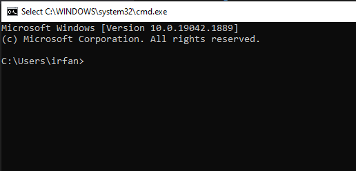

### File System

**File system** adalah sebuah sistem yang mengatur/mengelola sebuah data dan direktori, dan file system menggunakan struktur berbentuk tree

**perintah-perintah di Command Line Interface (CLI)**

- pwd : perintah untuk melihat direktori saat ini

  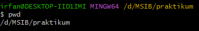

- ls : perintah untuk melihat isi direktori

  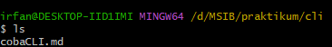

- cd : perintah untuk pindah direktori

  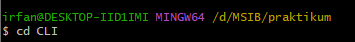

- mkdir : perintah untuk membuat direktori

  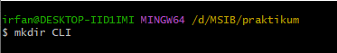

- touch : perintah untuk membuat file

  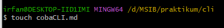

- cat : perintah untuk melihat isi file

  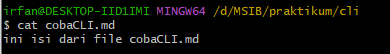

- cp : perintah untuk copy/salin

  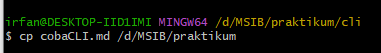

- mv : perintah untuk pindah file/direktori

  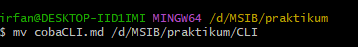

- rm : perintah untuk menghapus file/direktori

  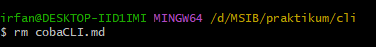

### **GIT & GITHUB**

**GIT** adalah version control system yang digunakan untuk mengelola sebuah file/direktori dan melakukan pencatatan ketika ada perubahan

**GITHUB** adalah layanan GIT yang digunakan programmer untuk mengelola file yang berbasis cloud dengan cara dihosting dan **GITHUB** juga dapat digunakan untuk kolaborasi.

#### **Kondisi-kondisi di GIT**

- modified : kondisi sudah ada perubahan tetapi masih untracked atau belum ditandai dan belum disimpan di version control system
- staged : kondisi kondisi sudah ada perubahan tetapi belum disimpan di version control system
- comitted : kondisi sudah ada perubahan dan sudah disimpan di version control system

#### **Perintah-perintah di GIT**

##### - **setup GIT**

- setup awal

  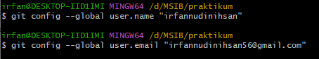

##### - **kelola repository GIT**

- git init : perintah untuk menginisialisasi repository

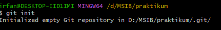

- git status : perintah untuk melihat kondisi

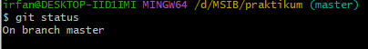

- git add : perintah untuk menambahkan kondisi di staging

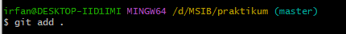

- git commit : perintah untuk menyimpan perubahan di version control system

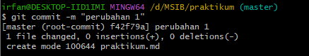

- git log : untuk melihat riwayat perubahan

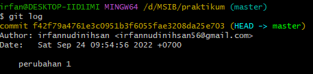

- git checkout : perintah yang digunakan untuk pindah perubahan

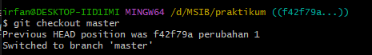
- git branch : perintah untuk mebbuat jalur lain tanpa menggangu master

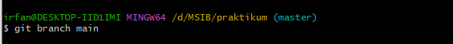

**Cara kerja GITHUB**
Programmer melakukan pengelolaan file/direktori di lokal, ketika akan melakukan upload dan bisa diakses secara publik prgrammmer akan melakukan perintah GIT/GITHUB secara CLI maupun GUI untuk upload di platform **GITHUB**

##### - **cara upload dit GITHUB**
1. buat repository baru di github
2. hubungkan repository local dengan repository github

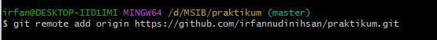


3. upload file/direktori di local ke repository github

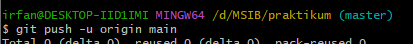

## Day 2 : HTML 
**Selasa, 20 September 2022**
### **Hypertext Markup Language (HTML)**
#### Hypertext Markup Language (HTML) : bahasa markup yang digunakan sebagai struktur web

##### **Sturktur HTML**
Struktur HTML adalah kerangka kerja yang dimiliki HTML untuk menuliskan kode agar lebih terstruktur
- doctype : deklarasi untuk sebuah file dengan type HTML
- html : untuk menginformasikan yang diakses oleh browser yaitu file html
- head : tempat untuk meletakkan berbagai informasi pada html
- body : tempat menuliskan kode pada file html

##### **Anatomy HTML**
Anatomy HTML : susunan terurut dari HTML contohnya element, tag, content

##### **Element HTML**
Element adalah komponen yang menyusun dokumen HTML yang terdiri dari opening tag, content, closing tag.
- <p> paragraf </p> : tag paragraf
- <h1> heading </h1> : tag heading
-  : tag image

##### **Atribute HTML**
Atribute adalah tambahan styling untuk element HTML

##### **Cara kerja HTML**
HTML dapat berjalan dan dapat diakses melalui browser

lalu bagaimana cara menjalankan **HTML**? untuk menjalankannya harus menggunakan tools, berikut :
##### **tools cara menjalankan HTML**
-text editor (VScode, Sublime text, vim, notepad++)
-browser (chrome, mozilla, Microsoft Edge)

##### **Membuat file HTML**
 1. membuat file HTML menggunakan text editor (Visual Studio Code) dengan format ektensi HTML
 2. membuat sturktur HTML doctype,html,head,body
    ``` 
    <!DOCTYPE html>
    <html lang="en">
    <head>
    <title>praktikum</title>
    </head>
    <body>

    </body>
    </html>
    ```
3. menambahkan element HTML, atribute HTML, semantic HTML
    ``` 
    <!DOCTYPE html>
    <html lang="en">
    <head>
    <title>praktikum</title>
    </head>
    <body>
    <section id="profile">
      <h1>nama : Irfannudin Ihsan</h1>
    </section>

    <section id="contact-me">
      <h2>contact me</h2>

      <form action="">
        <div class="input">
          <label for="">name</label>
          <input type="text" name="" id="" />
        </div>

        <div class="input">
          <label for="">email</label>
          <input type="email" name="" id="" />
        </div>
        <button>send</button>
      </form>
    </section>
    </body>
    </html>
    ``` 

