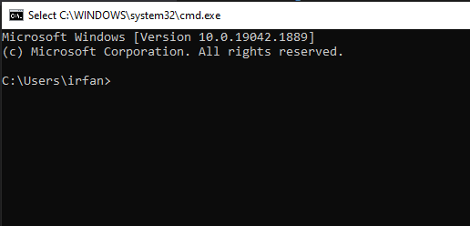

# Writing-and-Presentation-Test week 1

## #Day 1 : Unix Command Line dan GIT & GITHUB
**Senin, 19 September 2022**

### Command Line Interface (CLI)
**Command Line Interface (CLI) : shell yang berbasis teks**

lalu shell itu apa? **Shell** adalah program yang menerima perintah lalu di eksekusi oleh system.

untuk mengakses CLI bisa menggunakan GIT

**cara mengakses CLI bagaimana?**
klik kanan logo windows > klik run > lalu ketikan cmd > klik ok

### File System
**File system** adalah sebuah sistem yang mengatur/mengelola sebuah data dan direktori, dan file system menggunakan struktur berbentuk tree

**perintah-perintah di Command Line Interface (CLI)**
- pwd : perintah untuk melihat direktori saat ini

- ls : perintah untuk melihat isi direktori
![ls] (/ls.png)
- cd : perintah untuk pindah direktori
- mkdir : perintah untuk membuat direktori
- touch : perintah untuk membuat file
- cat : perintah untuk melihat isi file
- cp : perintah untuk copy/salin
- mv : perintah untuk pindah file/direktori
- rm : perintah untuk menghapus file/direktori

